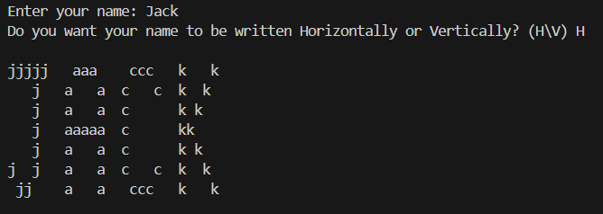

# SpellUrName

A Python program that displays your name in a pixelated format in the terminal. Each letter of your name is written in a billboard-like style using the letter itself.
It can write it down horizontally or vertically.




## Usage

To run the program, execute the following command:

```bash

python SpellUrName.py
